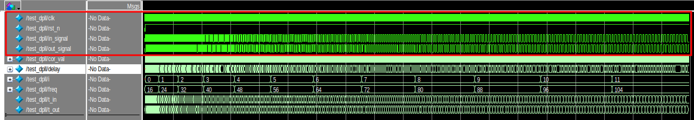
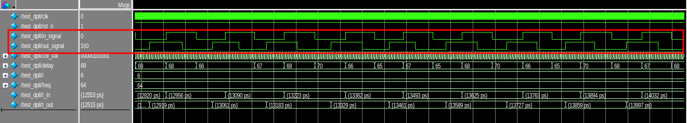

<i><b>This repository provides a Verilog implementation of a fully digital Phase Locked Loop (PLL) using a XOR gate as the phase detector. The design targets FPGA for clock generation, recovery, or synchronization applications.</b></i>

<h1>Overview</h1>
A digital PLL locks an output clock to a reference clock by detecting phase differences between reference and feedback signals. The phase error drives a loop filter, which controls a digital numerically-controlled oscillator to adjust frequency and phase.

<h1>Key Components</h1>

<b>XOR Phase Detector</b>: Outputs XOR operation between reference and feedback signals. 

<b>Loop Filter</b>: Proportional + Integral (PI) controller for stability. 

<b>NCO</b>: Frequency-adjustable oscillator using counter. 

<h1>Features</h1>
Configurable loop filter gains (Kp, Ki). 
Lock detect indicator. 
Clock frequencies: 10-100 MHz reference. 

<h1>File Structure</h1>

<b>Digital-PLL</b> 
├── code/ 
│   ├── dpll.v          # Top-level module 
│   ├── phase_detect.v  # Phase detection with XOR 
│   ├── lpf.v           # PI loop filter 
│   └── nco.v           # Digital NCO 
├── .test/ 
│   ├── test_dpll.v     # Testbench with reference clock generator 
└── README.md           # This file 

<h1>Result</h1>

<h1>Theory of Operation</h1>
Phase Detection: XOR produces pulses proportional to phase error Δφ. A sample is then obtained periodically to determine the average phase error in a unit sample. 

Loop Filter: error output is smoothened via a pi control filter. 

NCO: Base Frequency is adjusted in accordance to the filtered error output. 

Locking: Steady-state when f_ref ≈ f_nco and phase error(Δφ) ≈ 0.  
<!--
Phase Detection: XOR produces pulses proportional to phase error Δφ. Average duty cycle ~ Δφ/180°. 
Loop Filter: error_acc += (pd_out ? Kp : -Kp) + Ki*integral smooths error for DVCO control word. 
NCO: Up/down counter adjusts period: period = BASE + control[7:0]. Rising edge generates clk_out. 
Locking: Steady-state when fref/N ≈ f_vco and Δφ ≈ 0. Loop bandwidth ~1-10% of fref. 
Transfer Function: Classical 2nd-order PLL, damping ζ ≈ 0.7 for Kp/Ki tuning.[standard PLL theory] 
<h3>Limitations</h3>
XOR PI limited to 0-90° error range; use for narrowband apps. 
No spread-spectrum or fine freq steps. 
Metastability risk in async XOR; add synchronizers for >100MHz.
-->
